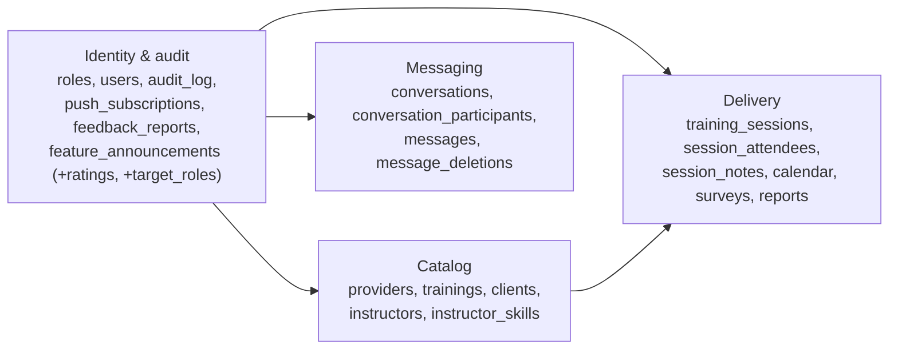

# Database architecture

PostgreSQL 16, accessed through Prisma (data access only) with a purpose-built SQL migration runner that owns the
schema. This document explains the design and the reasons behind it. Exact, always-current column/constraint/index
listings are generated from the database itself:

| Need | Where |
|---|---|
| Every table, column, key, index, trigger and enum | [database/SCHEMA-REFERENCE.md](database/SCHEMA-REFERENCE.md) |
| Diagrams (whole schema + one per domain) | [database/ERD.md](database/ERD.md) (renders on GitHub) |
| Interactive, zoomable diagrams and a filterable table list | [database/erd.html](database/erd.html) (open in a browser) |
| Machine-readable schema | [database/schema.json](database/schema.json) |
| Live GUI with pgAdmin's own ERD tool | `docker compose --profile tools up -d pgadmin`, then <http://127.0.0.1:5051> |

Regenerate the four generated files with `npm run docs:db` (against a migrated database). CI fails if they are stale
(`npm run docs:db -- --check`), so they cannot drift from the migrations.

## 1. Viewing the schema as a diagram (GUI)

1. **pgAdmin (recommended for exploring).** `docker compose --profile tools up -d pgadmin`, open
   <http://127.0.0.1:5051> (localhost only, no login). The "Training Platform" group already lists the main and dev
   databases; enter the `app_runtime` / `app_runtime_dev` password from your `.env` when asked. To draw the links between
   tables: right-click the database (or its `public` schema) -> **ERD Tool** -> it lays out every table with its foreign
   keys. Table and column descriptions shown in pgAdmin come from `COMMENT ON` statements (migration `0009`).
2. **`docs/database/erd.html`** needs no server: open the file in a browser. Tabs switch between the whole schema and
   the four domain diagrams; the +/- buttons zoom.
3. **`docs/database/ERD.md`** renders the same diagrams directly on GitHub and in VS Code's Markdown preview
   (with the Mermaid extension).

## 2. Topology and access control

```
                         +--------------------+
   app (Express) ------> | app_runtime        |  DML only, no DDL
                         +--------------------+
   migrate job   ------> | app_migrator       |  owns the schema, runs DDL
                         +--------------------+
   provisioning  ------> | postgres superuser |  creates roles, ownership, databases
                         +--------------------+
```

- **Least privilege.** The running API connects as `app_runtime`: `SELECT/INSERT/UPDATE/DELETE`, nothing else. A leaked
  application credential cannot drop or alter anything. After every migration the runner *reconciles* that role's
  privileges: `audit_log` becomes append-only for it (no `DELETE`/`TRUNCATE`; `UPDATE` only on the three columns the
  GDPR redaction needs) and `schema_migrations` is hidden from it.
- **Separate dev database.** `docker compose --profile dev` creates `training_platform_dev` with its own roles
  (`app_migrator_dev`, `app_runtime_dev`) and credentials; those roles get "permission denied" on the main database.
  The dev backend blanks SMTP and push settings so a dev database holding copied data can never message real users.
- **On OKD** the same split is available as opt-in Helm values (`database.leastPrivilege.enabled`); see the gitops
  repository's `docs/DATABASE-OPERATIONS.md`.
- **Data never flows dev -> prod.** Only migration files and images are promoted. Refreshing dev from prod is a
  restore of a dump into the dev database, never the other way round.

## 3. Domain map



`training_sessions` is the centre of the domain: a training, delivered to a client, optionally by one instructor.
Everything that happens *in* a session (attendees, notes, calendar entry, surveys, report) hangs off it with
`ON DELETE CASCADE`. Everything that merely *records who did something* points at `users` with `ON DELETE SET NULL`, so
removing an account never destroys business records.

## 4. Normalisation

The schema is in third normal form. Every non-key column depends on the key, the whole key and nothing but the key,
with the deliberate, documented exceptions below.

| Form | Status | Notes |
|---|---|---|
| 1NF | Yes | Atomic columns; each table has a primary key. The one former violation, the JSON list `feature_announcements.target_roles`, now has a proper relational form, `feature_announcement_target_roles` (see 4.2). |
| 2NF | Yes | Composite-key tables (`instructor_skills`, `conversation_participants`, `message_deletions`, `feature_announcement_target_roles`) contain only attributes of the whole key. |
| 3NF | Yes, with the exceptions in 4.1 | No transitive dependencies are left except where a copy is intentional. |

### 4.1 Deliberate denormalisations

Each is a decision, not an oversight; the reasons are stored as column comments (visible in pgAdmin).

| Where | What is duplicated | Why it is kept |
|---|---|---|
| `calendar` (`event_date`, `end_date`, `title`) | Copy of the session's dates | The calendar entry is editable independently of the session it was generated from. |
| `surveys.instructor_id` | Snapshot of the session's instructor at submission time | A later reassignment of the session must not rewrite whom a past survey was about. |
| `reports` (`average_score`, `nps_average`) | Aggregates of `surveys` | Frozen at generation time so a report never changes after it was issued. |
| `session_attendees.survey_submitted` | Whether a `surveys` row exists | Cheap "who still has to answer" filter; kept in step by the use case. |
| `session_attendees` (`name`, `email`) | Attendee identity per session | Attendees are not accounts; the same person is a separate row per session, matched by email for overlap rules. |
| `audit_log.before` / `after` | JSON snapshots of the changed row | An audit trail must survive schema changes, so it is schema-less by design. |
| `feature_announcements.target_roles` | JSON copy of the target role names | Transitional (see 4.2). |

### 4.2 The announcement roles migration (expand / contract)

Migration `0007` created `feature_announcement_target_roles (announcement_id, role_id)` with foreign keys to both parents,
back-filled it from the JSON list without modifying any existing row, and added a trigger that keeps it in step with
the JSON column. The application now *reads* the relational table (an indexed lookup instead of a JSONB scan).

The JSON column is retained on purpose: during a rolling deploy, pods still running the previous release write only the
JSON column, and the trigger keeps the table correct for them. **Contract step (not yet done, needs explicit approval
because it drops a column):** once no old release can run, write the table directly from the repository, then apply a
`.destructive` migration that drops the trigger, the function and the column, with `ALLOW_DESTRUCTIVE_MIGRATIONS=true`.
`npm run db:audit` reports any announcement whose JSON and table disagree (must be zero).

## 5. Integrity model

Constraints are the last line of defence; the API validates first (Zod, in the HTTP layer) and the use cases enforce
business rules with friendly messages, but no bug can write a row the database refuses.

- **Primary keys** on every table (surrogate `SERIAL` ids; composite natural keys on pure junction tables).
- **Foreign keys** everywhere a relationship exists. Delete behaviour is chosen per relationship:
  - `CASCADE` for parts owned by their parent (a session's attendees, notes, calendar entry, surveys and report; a
    conversation's messages and participants; a user's push subscriptions).
  - `SET NULL` for "who did this" pointers to `users`, and for optional links (`training_sessions.instructor_id`,
    `messages.reply_to_message_id`), so purging an account or deleting a message never destroys other records.
  - `NO ACTION` where deleting would orphan history that must stay (a client or training that has sessions; a role
    that has users; an attendee that has a survey).
- **Composite foreign keys** enforce rules a single-column key cannot: a survey's attendee must belong to the survey's
  session; a reply, a read marker and a delivered marker must reference a message *of the same conversation*
  (`ON DELETE SET NULL (column)` clears only the pointer).
- **Unique rules:** case-insensitive account emails; one survey per attendee; one email per session (case-insensitive,
  blank/NULL allowed); a training and an instructor can each start only one non-cancelled session at a given instant.
  These mirror rules the use cases already enforced, so the database adds a backstop, not a new restriction. Overlapping
  time ranges for one instructor are allowed by design (a test asserts it).
- **Check constraints:** non-blank names and titles, email shape, upper-case ISO-2 country, non-negative duration and a
  unit only with a duration, message type/body/attachment consistency, https push endpoints, plus the original score
  and date checks.
- **Tolerating legacy data.** Existing rows were never modified to make a constraint pass. Constraints are written to
  accept the shapes real data already has (blank client/attendee emails, a duration without a unit, approved users
  without `approved_at`). `npm run db:audit` lists those rows so a cleanup can be decided separately.
- **Adding constraints safely.** New `CHECK`/`FOREIGN KEY` constraints on existing tables are added `NOT VALID` (enforced
  for new writes at once, existing rows untouched) and validated in a *separate* migration, so the validation scan never
  holds the stronger lock. A read-only preflight (`0002`) aborts, before anything is applied, with a report of counts
  and ids (no personal data) if any row would violate a new rule.

## 6. Data lifecycle

- **Soft delete:** providers, trainings, clients (`deleted_at`) and messages (`deleted_at`). Partial indexes
  (`WHERE deleted_at IS NULL`) keep active-row queries fast, and provider names are unique among *active* providers.
- **Purge (SuperAdmin):** the user row is deleted; `ON DELETE SET NULL` detaches what they created, and their
  `audit_log` entries are first marked `actor_deleted` and their personal fields redacted.
- **Audit log:** append-only for the application role; entries survive the purge of the actor.
- **Attachments** live on disk; the database stores only the storage key and metadata.

## 7. Indexing

- Every foreign-key column has a supporting index (partial `WHERE col IS NOT NULL` for nullable ones), so joins and
  parent deletes stay fast as data grows. The one deliberate exception is `users.role_id` (five distinct values).
- Functional unique index `lower(email)` serves both login lookups and the uniqueness rule.
- Indexes on existing tables are built `CONCURRENTLY` (a `.notx` migration), so writes are not blocked.
- Invalid indexes left by a failed concurrent build, and unvalidated constraints, are reported by `npm run db:audit`.

## 8. Migrations, environments and promotion

| Concern | How it works |
|---|---|
| Source of truth | Numbered, immutable files in `src/infrastructure/database/migrations/`; `prisma/schema.prisma` mirrors them for typed queries and CI fails on drift. |
| Runner | Advisory lock (no concurrent migrations), one transaction per migration, checksums recorded in `schema_migrations`; a changed applied file aborts the run. Checksums ignore comments and whitespace so the git comment-stripping filter cannot cause a mismatch. |
| Safety rules | `npm run db:lint`, enforced in CI: no `UPDATE/DELETE/TRUNCATE/DROP/rename/type change` outside a `*.destructive.sql` file (which also needs `ALLOW_DESTRUCTIVE_MIGRATIONS=true`), `NOT VALID` constraints, `CONCURRENTLY` indexes, no grants in migrations. |
| Dry run | `npm run db:plan` executes all pending migrations in a transaction that is rolled back. Read-only. |
| Promotion | Dev database -> tests + CI -> merge -> prod. `docker compose --profile promote run --rm promote-prod` refuses unless every pending migration is already applied on the dev database with the same checksum. |
| CI | `upgrade-safety` loads sample data into the *previous* schema, applies the branch's migrations, and fails if any existing row changed; `migrations` checks lint, immutability, fresh install, idempotence, Prisma drift and docs freshness. |
| Backups | Verified `pg_dump` before any live change; on OKD an opt-in CronJob with integrity check and retention. |

**Adding a feature, in practice**

- *New nullable column:* one migration, `ALTER TABLE ... ADD COLUMN IF NOT EXISTS`, then add it to `schema.prisma`.
- *New column that must be required:* add it nullable (or with a default), ship the code that writes it, back-fill in
  a reviewed migration, then add the `NOT NULL`/`CHECK` as `NOT VALID` and validate in a later migration.
- *New table:* one migration; its indexes and constraints may be created inline. Add a `COMMENT ON` for the table.
- *New enum value:* `ALTER TYPE ... ADD VALUE`, in its own migration.
- *Index on an existing table:* a `.notx` migration with `CREATE INDEX CONCURRENTLY IF NOT EXISTS`.
- *Removing anything:* a separate, reviewed `.destructive` migration, only after no running release uses it.

## 9. Growth and scaling notes

- The workload is transactional with modest volume. The tables that will grow without bound are `audit_log`,
  `messages` and `message_deletions`; all have the indexes their queries need. If `audit_log` becomes large, partition it
  by month on `created_at` (the append-only rule makes this straightforward) and archive old partitions.
- Connection pooling: one `pg.Pool` per API process; with several replicas, size `max` so the total stays below
  `max_connections`, or add PgBouncer (if using transaction pooling, first check how Prisma's pg adapter handles prepared statements; the migration runner itself needs a direct connection because it uses a session-level advisory lock).
- JSONB is confined to audit snapshots and the transitional announcement column; new relational data should get
  proper tables.
- Read scaling, if ever needed, can use a streaming replica for the reporting queries (`$queryRaw` aggregates in the
  session, survey and announcement repositories).

## 10. How this is verified

- **Unit tests** for the migration tooling, linter, SQL scanner, error translation and request validation.
- **Integration tests against a real PostgreSQL** for every repository, every constraint (bad data is rejected, legacy
  shapes stay writable), the sync trigger, the audit-log privileges, and the migration runner itself (rollback,
  checksums, concurrency, `CONCURRENTLY`, promotion gate).
- **Upgrade-safety**: hashing every row before and after applying migrations, on a restore of real data and on the CI
  fixture.
- **End-to-end HTTP flow** through the real application and database.
- **Generated documentation** compared byte-for-byte against a fresh install and against a database that evolved
  through the legacy schema: identical.
