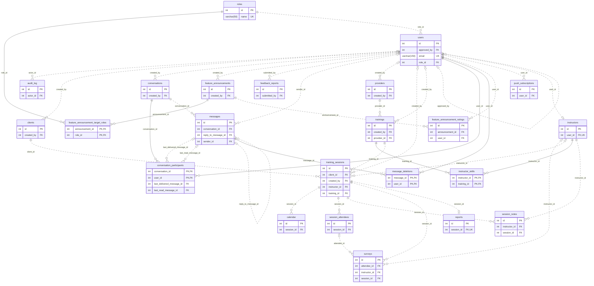
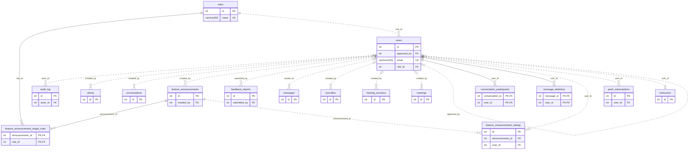
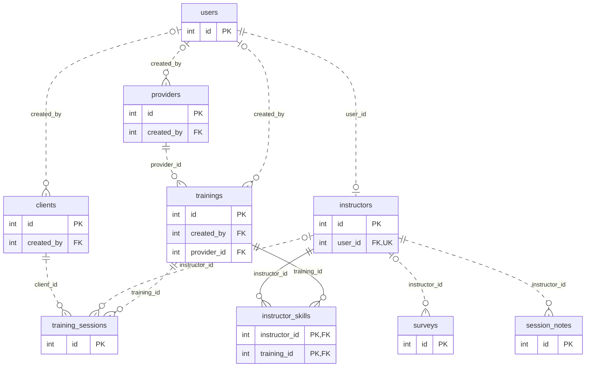
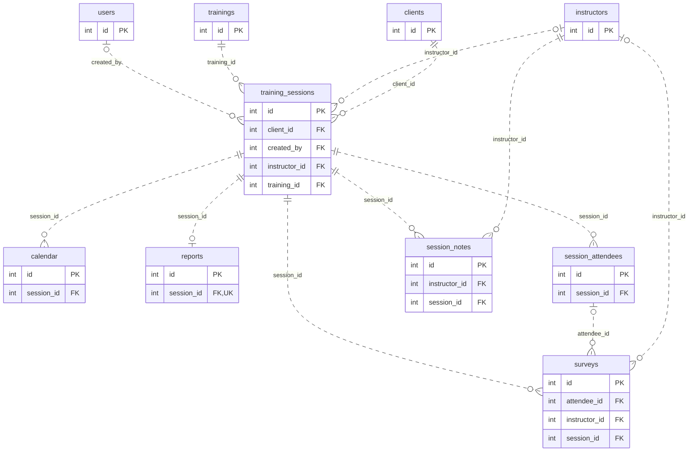
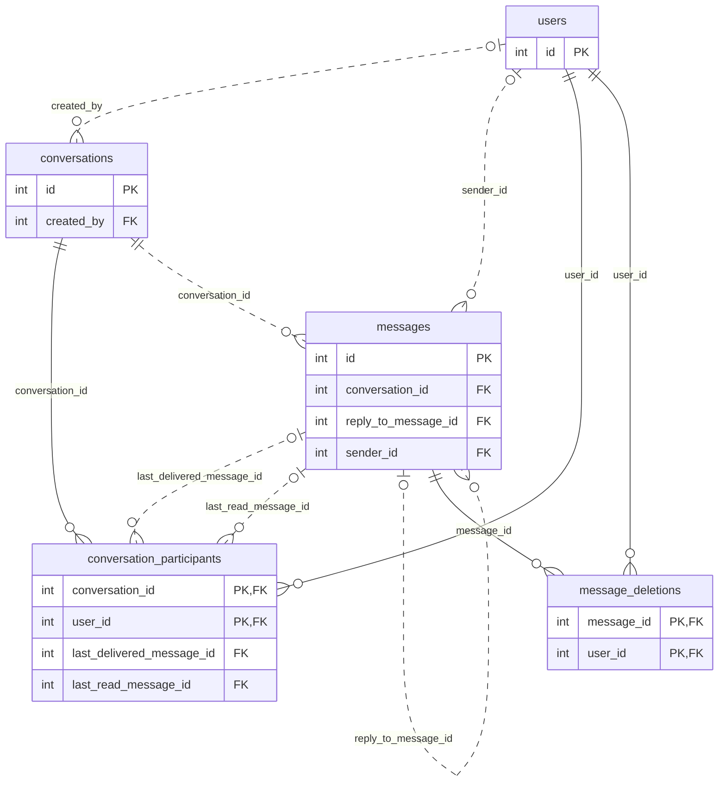

# Entity-relationship diagrams

> Generated by `npm run docs:db` from a migrated database. Do not edit by hand.
> Crow's-foot notation: `||` exactly one, `o|` zero or one, `o{` zero or many. A solid line is an identifying
> relationship (the foreign key is part of the child's primary key); a dotted line is a plain reference.
> Only key columns are drawn; see [SCHEMA-REFERENCE.md](SCHEMA-REFERENCE.md) for every column.

## Whole schema

## Identity, notifications and audit

## Catalog: providers, trainings, clients, instructors

## Delivery: sessions, attendees, surveys, reports

## Messaging

